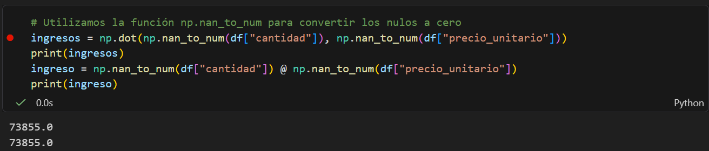
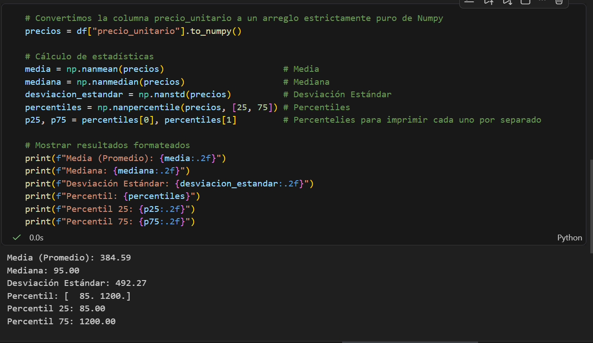

## Primer Punto: Numpy y Fundamentos Python

### 1.1 Setup del entorno virtual: reto_u1 

### 1.2 Algebra lineal aplicada:
Me aparece como resultado el termino nan, por el motivo de que hay columnas con valores faltantes o nulos, para solucionar este resultado debemos utilizar pandas.

Para poder dare solución a esto, hay diferentes maneras, una de ellas es utilizar la función **np.nan_to_num:** Esta función de NumPy hace exactamente lo mismo que .fillna(0) de Pandas: transforma todos los NaN en ceros.
Podemos realizarlo de dos maneras:
Utilizando multiplicación matricial con numpy.dot y con el operador @

### 1.3 Estadísticas con Numpy
Cuando convertimos una columna a un arreglo estrictamente puro de Numpy y hay valores nulos (nan) dentro de ella siempre nos da como resultado (nan), para ello utilizamos el prefijo nan, Numpy ofrece una familia de funciones (np.nanmean, np.nanmedian, etc) estas funciones lo que hacen es ignorar todos los nulos que se presentar dentro de la columna.
Para sacar valores estadísticos del precio unitario con Numpy se realiza de la siguiente manera:

### 1.4 Reflexión CRISP-DM
Para mi la fase mas importante de la metodologia **CRISP-DM** para desarrollar es la primera: **Comprensión del negocio** esta fase nos dice que lo primero que debemos realizar es identificar los objetivos y necesidades del proyecto teniendo claro cual es la problematica que vamos a resolver, si nosotros como desarrolladores de un proyecto no tenemos claro estos obejtivos y necesidades vamos a fracazar en las demas fases y no vamos a terminar con una buena finalidad el proyecto.

